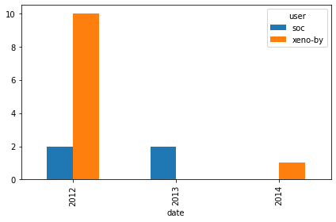

# The-GitHub-History-of-the-Scala-Language
Find the true Scala experts by exploring its development history in Git and GitHub.


## Getting Started

```bash
git clone https://github.com/AyazRao/The-GitHub-History-of-the-Scala-Language.git
cd https://github.com/AyazRao/The-GitHub-History-of-the-Scala-Language.git
```

# Project Description

This project explores the development history of the Scala programming language by analyzing its Git and GitHub repositories. The dataset includes information on pull requests and modified files.

## Task 1: Importing the Dataset

- Import the pandas module.
- Load 'pulls_2011-2013.csv' and 'pulls_2014-2018.csv' into pulls_one and pulls_two.
- Load 'pull_files.csv' into pull_files.

## Task 2: Cleaning the Data

- Combine pulls_one and pulls_two, converting the date column to DateTime objects with UTC.
- Merge pulls and pull_files on the pid column, storing the result in the data variable.

## Task 3: Merging DataFrames

- Merge the two DataFrames (pulls and pull_files) on the pid column.

## Task 4: Project Activity

- Calculate and plot the number of pull requests per month to understand the project's activity over time.


## Task 5: Community Dynamics

- Plot a histogram showing the number of pull requests submitted by each user to assess community dynamics.


## Task 6: Recent File Changes

- Identify files changed in the last ten pull requests.


## Task 7: Top Developers for a Specific File

- Identify the top 3 developers who submitted pull requests to
  'src/compiler/scala/reflect/reify/phases/Calculate.scala'.
  


## Task 8: Recent Pull Requests on a File

- Identify the most recent ten pull requests that touched 'src/compiler/scala/reflect/reify/phases/Calculate.scala'.


## Task 9: Developers' Contribution Trend

- Plot the number of pull requests submitted by two developers over time.


## Task 10: Visualizing Contributions

- Calculate the number of pull requests submitted by a developer to a file each year and visualize the data.




Please follow the provided instructions in the respective tasks to complete the analysis.
